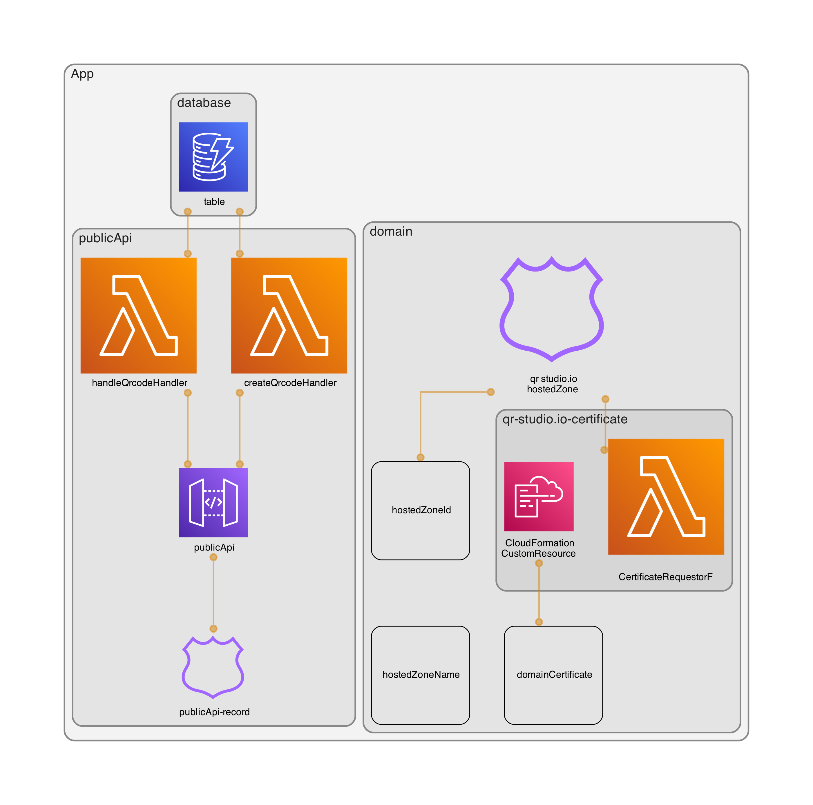

# qr-studio

This project uses AWS CDK with TypeScript.

## Configuration and setup

- install *aws-cli*
- configure *aws-cli* and a default profile
- run `npm run bootstrap`

## Diagram generation (optional)

It uses [cdk-dia](https://www.npmjs.com/package/cdk-dia) package to create a diagram of the infrastructure.

You need to install [graphviz](https://graphviz.org/download/) first.

Then run `npm run diagram` to generate the diagram.

### Diagram

## Useful commands

* `npm run deploy --all`   deploy all the stacks to aws
* `npm run deploy xxx`     deploy the stacks that matched the reg exp provided
* `npm run cdk deploy`     deploy this stack to your default AWS account/region
* `npm run cdk diff`       compare deployed stack with current state
* `npm run cdk synth`      emits the synthesized CloudFormation template

